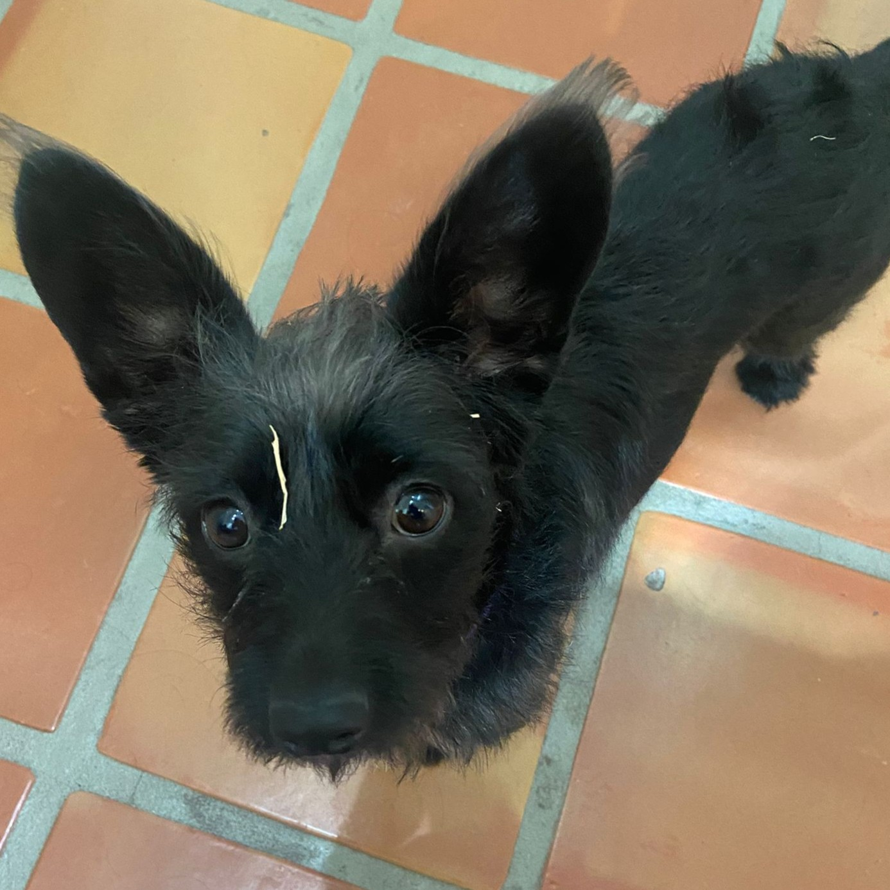

<h1 align="left">Hello! I am Alberto!</h1>

###

  
  
  
  
  
  
  
  
  
  
  
  
  
  
  
  
  
  
  
  
  
  
  
  
  
  
  
  
  
  
  
  
  
  
  
  
  
  
  
  
  
  
  
  
  
  
  

###

  

###

###

🔸I am a CS student currently focusing on backend systems, distributed systems architecture, and product engineering.  🔸Currently learning more about system design, GO, and Crystal.  🔸I am open to SWE roles, Product Engineering roles, or collaborating on new projects. Feel free to reach out if interested to collaborate!  🔸Outside of the internet, I am a fashion nerd really into fashion history and design. I also do calisthenics and currently training to climb Mount Washington.  🔸Here is a pic of my dog, Luna!! Isnt she adorable

###

 

  

###

  
  
  
  

###

  

###

  

###

  

###
